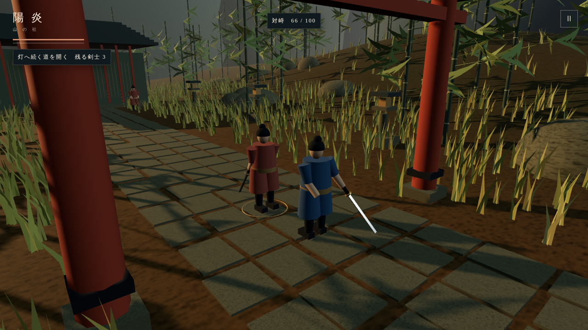
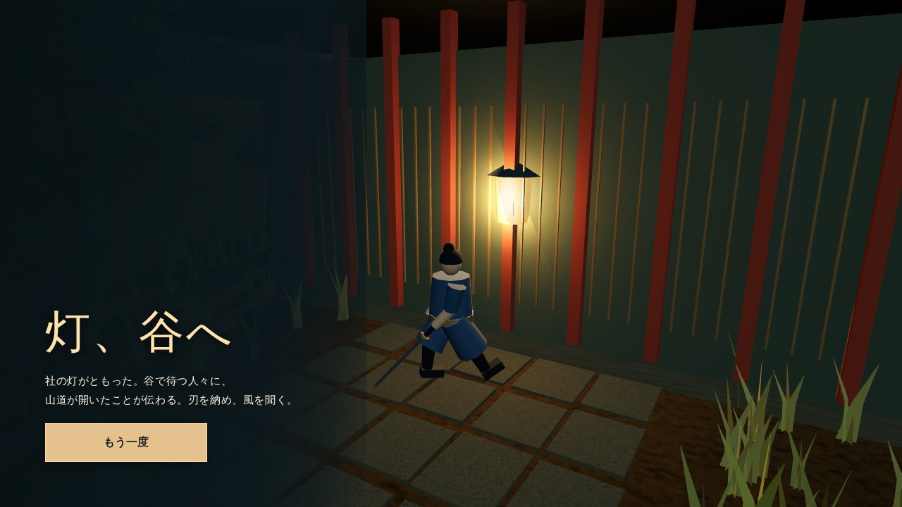
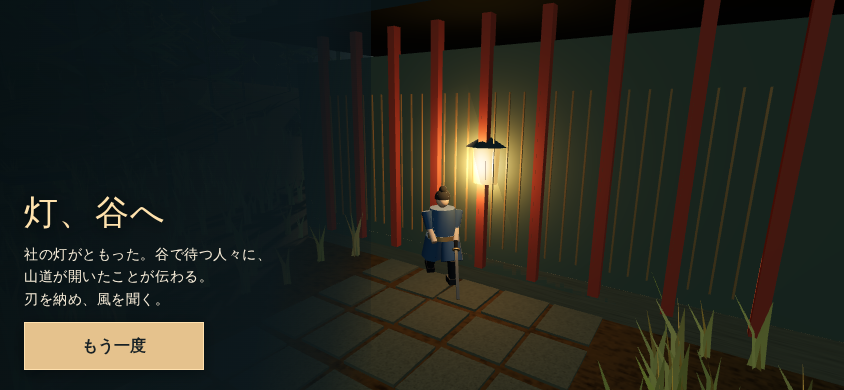
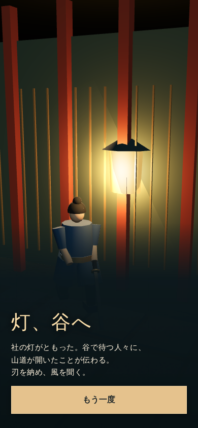
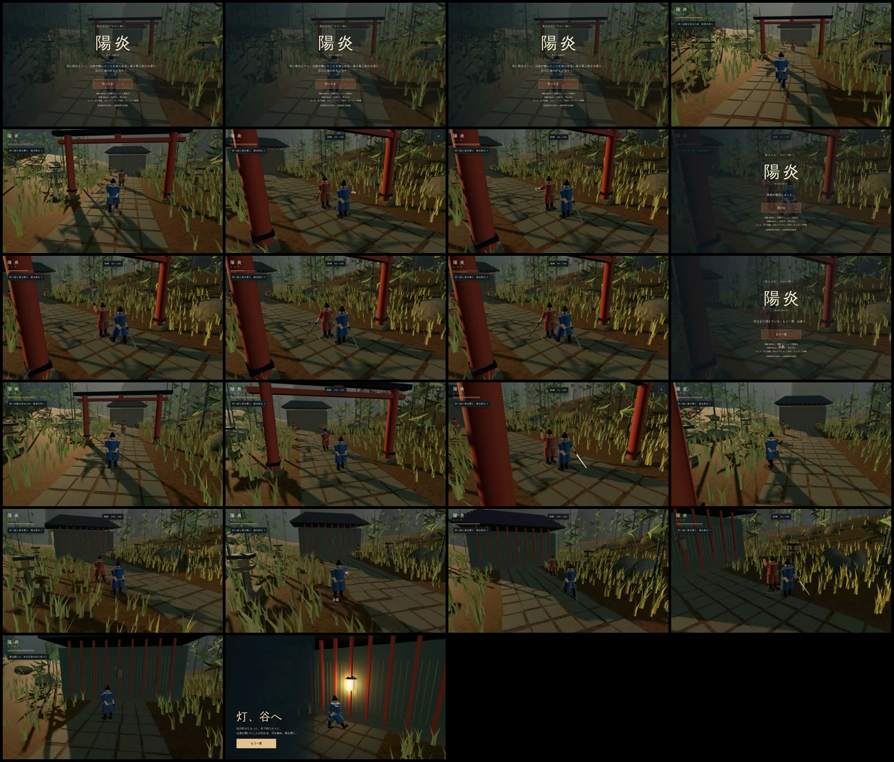
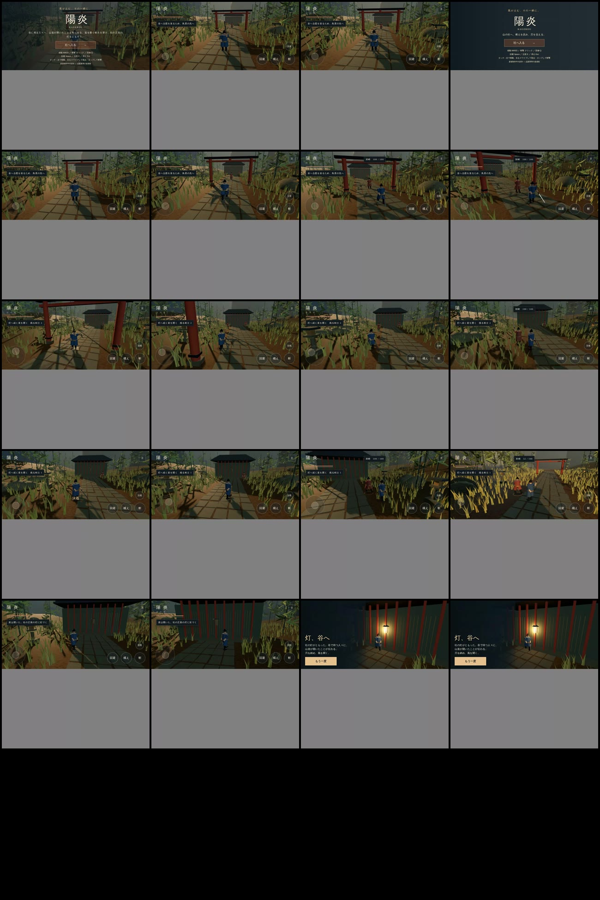

# 新作 5afdd48 の実描画診断

対象は新規制作 `5afdd48e56613adfdbd26f54e5b2c02a79b3ffc2`。[実入力CI](https://github.com/bachikoljunior-blip/game2/actions/runs/34823475645)の既存成果物を[別の抽出処理](https://github.com/bachikoljunior-blip/game2/actions/runs/34825712915)で照合した。ゲームの再実行ではない。

原PNG6枚は無変更。ZIP・動画・各画像のハッシュ、blob、取得元、独立診断は [receipt.json](receipt.json) に保存。動画本体は元CIの artifact10338653945（期限2026-12-13）に保全され、取得処理から再現できる。参照作品とのブラインド比較ではなく、全10要素は未測定。

## 原画像

## 連続映像からの5秒間隔サンプル

同じ動画を間引いた静止画であり、全動作の評価ではない。時刻は概算。タッチ動画の灰色は固定844×844記録面の余白、黒い空白セルは配置枠の余り。末尾の縦画面は原PNGでも別に保持する。両動画は無音で、復号フレーム数には重複が含まれる。スマートフォン実性能の証拠ではない。

独立診断では、真上になる視点と横画面の足埋まりは提示範囲で見られず、結果表示も収まった。残る大きな差は、敵の刀・人物の視認性、単調な参道と社の奥行き、人物の造形と終息の所作。縦画面の足元は暗いパネルに隠れ未確認。
